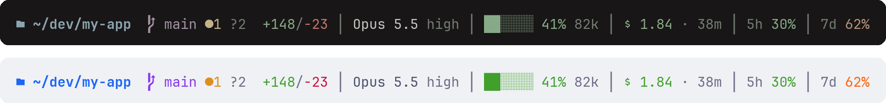

# Adaptive

[← all status lines](../../README.md)

A compact Python status line that switches palettes with your light/dark appearance and wraps instead of clipping in narrow panes.



```
 ~/proj   main ●2 ↑1 │ Opus 5.5 high │ ██░░░░ 41% 82k │  0.12 · 5m │ 5h 30%
```

## Features

- **Light/dark aware.** Kanagawa Dragon colors on dark backgrounds, Catppuccin Latte on light. On macOS it follows the system appearance. Elsewhere it defaults to dark.
- **No extra dependencies.** Plain Python 3 standard library: no `jq` and no `bc`.
- **Uses what Claude Code sends.** Context %, cost, duration, rate limits and lines changed come straight from the status line JSON, so there's no transcript parsing and no hard-coded pricing.
- **Wraps on narrow panes.** One line when it fits; otherwise segments wrap onto more lines, so nothing is cut off.
- **Skips missing fields.** Anything your Claude Code version doesn't send is left out.

| Segment | Shows |
|---|---|
| Directory | Current dir (`~`-shortened, deep paths collapsed to `…/a/b`), worktree name, `+N dirs` added |
| Git | Branch, `●` modified, `?` untracked, `↑` ahead, `↓` behind |
| Changes | `+added/-removed` lines this session |
| Model | Name, fast mode, effort level (unless medium), `nothink` |
| Agent / style | Active subagent, non-default output style |
| Context | 6-cell bar + % used + input tokens (green < 60%, orange < 85%, red after) |
| Cost | Session USD and wall time |
| Rate limits | 5-hour and 7-day usage % |
| PR / vim | Open PR number, vim mode |

## Requirements

- Python 3
- A truecolor terminal
- A [Nerd Font](https://www.nerdfonts.com/) for the folder, branch and PR icons

## Installation

```bash
curl -o ~/.claude/statusline.py https://raw.githubusercontent.com/levz0r/claude-code-statusline/main/statuslines/adaptive/statusline.py
chmod +x ~/.claude/statusline.py
```

`~/.claude/settings.json`:

```json
{
  "statusLine": {
    "type": "command",
    "command": "python3 ~/.claude/statusline.py",
    "padding": 0
  }
}
```

## Light/dark

Claude Code runs the status line on a pipe, so it can't ask the terminal for its background color. Instead it:

1. Uses `STATUSLINE_THEME=light` or `STATUSLINE_THEME=dark` if set
2. Otherwise reads `AppleInterfaceStyle` from the macOS global preferences
3. Otherwise assumes dark

To keep everything in sync, set your terminal to switch themes with the OS. Examples: Rio's `[adaptive-theme]`, kitty's `light-theme.auto.conf` / `dark-theme.auto.conf`, Ghostty's `theme = light:…,dark:…`. Also set Claude Code's theme to **Auto (match terminal)**.

## Customization

Colors live in the `PALETTES` dict at the top of the script; each mode has the same nine keys (`blue`, `mauve`, `green`, `peach`, `red`, `yellow`, `teal`, `muted`, `text`). Swap in any palette.
