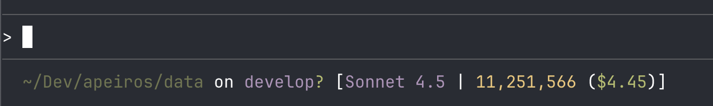

# Classic

[← all status lines](../../README.md)

A powerful, feature-rich statusline for [Claude Code](https://claude.ai/code) that displays comprehensive session information including directory, git status, model name, token usage, and real-time cost tracking.

## Features

- 🗂️ **Full directory path** with `~` home directory replacement
- 🌿 **Git integration**:
  - Current branch name
  - Working directory status (modified `!` / untracked `?`)
  - Commits ahead/behind upstream (`↑N` / `↓M`)
- 🤖 **Model information** - Current Claude model (Opus, Sonnet, Haiku)
- 📊 **Token usage tracking** - Real-time token count with comma formatting
- 💰 **Cost calculation** - Session cost based on model-specific pricing
- 🎨 **Color-coded display** for easy visual scanning

## Screenshot



**Example output:**
```
~/Dev/apeiros/data on develop? [Sonnet 4.5 | 7,599,934 ($3.22)]
```

**Colors:**

- Green: Directory path
- Magenta: Git branch and model name
- Cyan: Ahead/behind indicators
- Red/Green: Git status (modified/untracked)
- Yellow: Token count
- Green: Cost

## Installation

### Linux / macOS / WSL

1. **Copy the script to your Claude Code config directory:**

   ```bash
   curl -o ~/.claude/statusline-command.sh https://raw.githubusercontent.com/levz0r/claude-code-statusline/main/statuslines/classic/statusline.sh
   chmod +x ~/.claude/statusline-command.sh
   ```

2. **Update your Claude Code settings** (`~/.claude/settings.json`):

   ```json
   {
     "statusLine": {
       "type": "command",
       "command": "/bin/bash /Users/YOUR_USERNAME/.claude/statusline-command.sh"
     }
   }
   ```

   Replace `YOUR_USERNAME` with your actual username.

### Windows (PowerShell) - ⚠️ UNTESTED

> **Note:** This PowerShell version is provided as-is and has not been tested on Windows. Please report any issues or improvements!

1. **Copy the PowerShell script:**

   ```powershell
   # Create .claude directory if it doesn't exist
   New-Item -ItemType Directory -Force -Path "$env:USERPROFILE\.claude"

   # Download the script
   Invoke-WebRequest -Uri "https://raw.githubusercontent.com/levz0r/claude-code-statusline/main/statuslines/classic/statusline.ps1" -OutFile "$env:USERPROFILE\.claude\statusline-command.ps1"
   ```

2. **Update your Claude Code settings** (typically at `%USERPROFILE%\.claude\settings.json`):

   ```json
   {
     "statusLine": {
       "type": "command",
       "command": "powershell.exe -NoProfile -ExecutionPolicy Bypass -File \"%USERPROFILE%\\.claude\\statusline-command.ps1\""
     }
   }
   ```

3. **Ensure PowerShell execution policy allows the script:**

   ```powershell
   # Check current policy
   Get-ExecutionPolicy

   # If needed, set to allow local scripts (run as Administrator)
   Set-ExecutionPolicy -ExecutionPolicy RemoteSigned -Scope CurrentUser
   ```

## Requirements

### Linux / macOS / WSL

- **jq** - JSON processor for parsing transcript data

  ```bash
  # macOS
  brew install jq

  # Ubuntu/Debian
  sudo apt-get install jq

  # Fedora
  sudo dnf install jq
  ```

- **bc** - Basic calculator for cost calculations (usually pre-installed)

### Windows (PowerShell)

No additional requirements! PowerShell has built-in JSON parsing and math capabilities.

## How It Works

### Token Tracking

The script parses the Claude Code session transcript file to calculate:

- **Input tokens** - Fresh tokens processed without caching
- **Cache read tokens** - Tokens retrieved from prompt cache (90% cheaper)
- **Cache write tokens** - Tokens used to create cache entries
- **Output tokens** - Tokens generated by Claude

**Total tokens = input + cache_read + cache_write + output**

### Cost Calculation

Pricing is automatically detected based on your current model:

#### Claude Sonnet 4.5 (default)

- Input: $3.00 per million tokens
- Cache read: $0.30 per million tokens
- Cache write: $3.75 per million tokens
- Output: $15.00 per million tokens

#### Claude Opus

- Input: $15.00 per million tokens
- Cache read: $1.50 per million tokens
- Cache write: $18.75 per million tokens
- Output: $75.00 per million tokens

#### Claude Haiku

- Input: $0.25 per million tokens
- Cache read: $0.03 per million tokens
- Cache write: $0.30 per million tokens
- Output: $1.25 per million tokens

### Git Integration

The statusline shows:

- Current branch name
- `!` for modified/staged files (red)
- `?` for untracked files (green)
- `↑N` for N commits ahead of upstream (cyan)
- `↓N` for N commits behind upstream (cyan)
- `↑N↓M` for diverged branches (cyan)

## Customization

Edit the script to customize:

- Colors (ANSI escape codes)
- Separators and formatting
- Token/cost display format
- Git status indicators

### Color Codes

**Bash (Linux/macOS):**
```bash
\033[32m  # Green
\033[35m  # Magenta
\033[36m  # Cyan
\033[33m  # Yellow
\033[31m  # Red
\033[0m   # Reset
```

**PowerShell (Windows):**
```powershell
"`e[32m"  # Green
"`e[35m"  # Magenta
"`e[36m"  # Cyan
"`e[33m"  # Yellow
"`e[31m"  # Red
"`e[0m"   # Reset
```

## Troubleshooting

### StatusLine not updating

The statusline refreshes based on Claude Code's update frequency. Try:

- Running a command in Claude Code
- Changing directories
- Making a git commit

### Token count shows 0 or is missing

Ensure:

- `jq` is installed and in your PATH
- The transcript file exists and is readable
- You've had at least one assistant response in the session

### Cost calculation is incorrect

Verify:

- The model name in the statusline matches your actual model
- Pricing constants in the script match current Claude API rates
- `bc` is installed for calculations (Linux/macOS)

### Windows-specific issues

- **Colors not showing:** Ensure you're using Windows Terminal or a terminal that supports ANSI escape codes (PowerShell 5.1+ or Windows 10+)
- **Execution policy error:** Run `Set-ExecutionPolicy -ExecutionPolicy RemoteSigned -Scope CurrentUser` as described in installation
- **Path issues:** Make sure paths use backslashes and are properly escaped in the JSON settings file
- **Script not found:** Verify the path in settings.json points to the correct location: `%USERPROFILE%\.claude\statusline-command.ps1`
